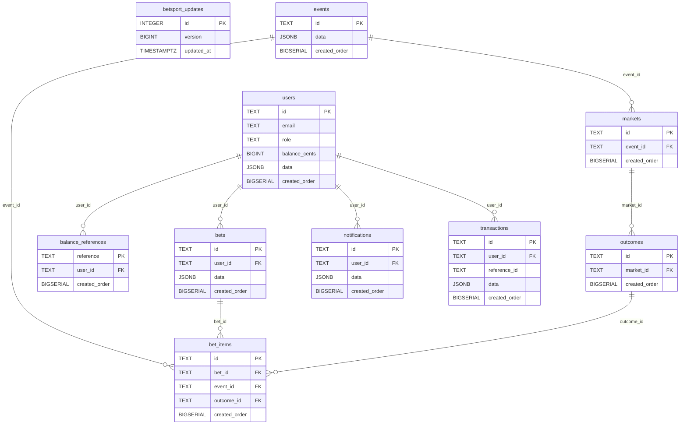
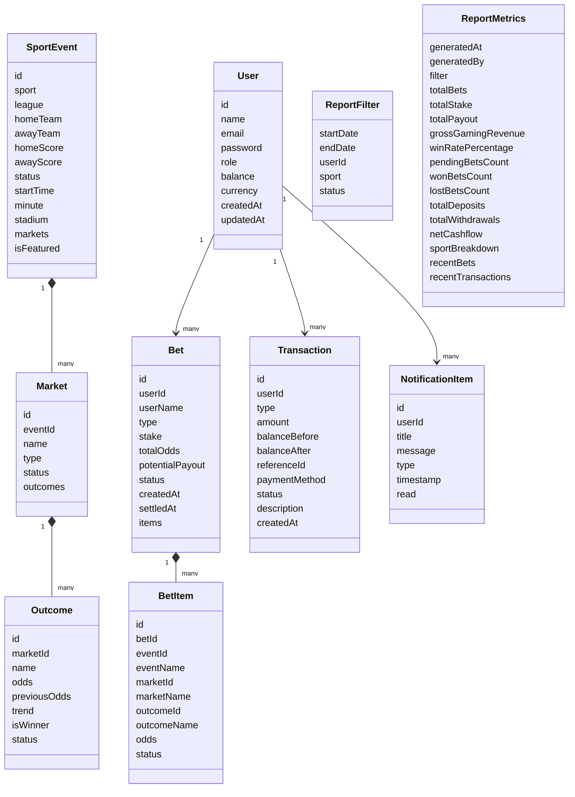
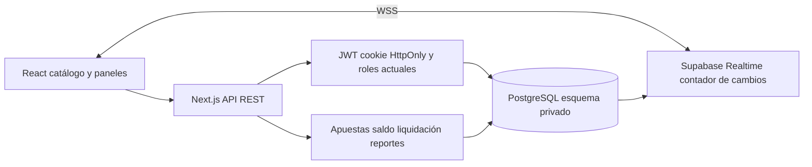
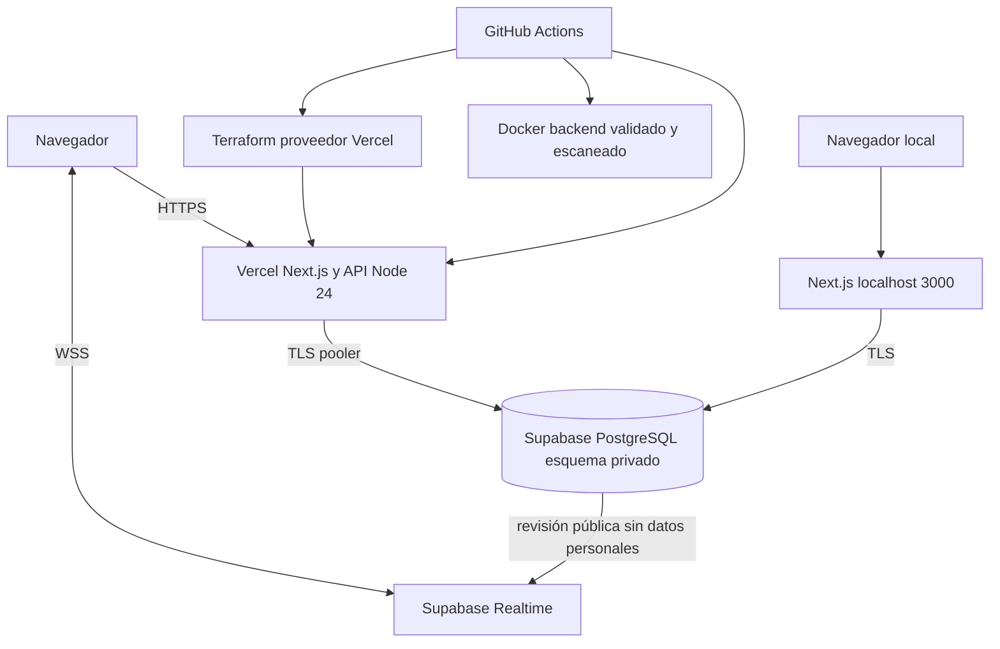

# Documentación del sistema BetSport Pro

Generada determinísticamente desde database/postgres.sql y lib/types.ts. No requiere credenciales ni datos de negocio.

## Arquitectura y persistencia

Next.js y React sirven la interfaz y API REST en Vercel con Node.js 24. PostgreSQL en Supabase conserva los datos de negocio en el esquema privado betsport. El pooler comparte conexiones TLS con certificado CA verificado. Las claves foráneas protegen las relaciones. Transacciones y pg_advisory_xact_lock serializan cambios de saldo y liquidación entre instancias. Los montos de saldo se guardan como centavos enteros; JSONB conserva las instantáneas del dominio.

La base comienza sin eventos, cuotas, apuestas, movimientos ni promociones. El primer registro es administrador y cada cuenta empieza con cero. La cuenta solicitada se crea explícitamente con scripts/create-user.cjs y variables privadas. Los movimientos pertenecen al proyecto personal y no ejecutan pagos externos.

Supabase Realtime publica mediante WebSocket únicamente la revisión de cambios de public.betsport_updates, con RLS de solo lectura. La interfaz consulta nuevamente la API autorizada. Recuperación mediante consultas cada 15 segundos. No hay cambios aleatorios ni proveedores simulados.

## Diccionario físico de datos


### balance_references

| Columna | Tipo PostgreSQL | Obligatoria | Clave |
|---|---|---|---|
| reference | TEXT | Sí | PK |
| user_id | TEXT | Sí | FK |
| created_order | BIGSERIAL | No |  |

### bet_items

| Columna | Tipo PostgreSQL | Obligatoria | Clave |
|---|---|---|---|
| id | TEXT | Sí | PK |
| bet_id | TEXT | Sí | FK |
| event_id | TEXT | Sí | FK |
| outcome_id | TEXT | Sí | FK |
| created_order | BIGSERIAL | No |  |

### bets

| Columna | Tipo PostgreSQL | Obligatoria | Clave |
|---|---|---|---|
| id | TEXT | Sí | PK |
| user_id | TEXT | Sí | FK |
| data | JSONB | Sí |  |
| created_order | BIGSERIAL | No |  |

### betsport_updates

| Columna | Tipo PostgreSQL | Obligatoria | Clave |
|---|---|---|---|
| id | INTEGER | Sí | PK |
| version | BIGINT | Sí |  |
| updated_at | TIMESTAMPTZ | Sí |  |

### events

| Columna | Tipo PostgreSQL | Obligatoria | Clave |
|---|---|---|---|
| id | TEXT | Sí | PK |
| data | JSONB | Sí |  |
| created_order | BIGSERIAL | No |  |

### markets

| Columna | Tipo PostgreSQL | Obligatoria | Clave |
|---|---|---|---|
| id | TEXT | Sí | PK |
| event_id | TEXT | Sí | FK |
| created_order | BIGSERIAL | No |  |

### notifications

| Columna | Tipo PostgreSQL | Obligatoria | Clave |
|---|---|---|---|
| id | TEXT | Sí | PK |
| user_id | TEXT | No | FK |
| data | JSONB | Sí |  |
| created_order | BIGSERIAL | No |  |

### outcomes

| Columna | Tipo PostgreSQL | Obligatoria | Clave |
|---|---|---|---|
| id | TEXT | Sí | PK |
| market_id | TEXT | Sí | FK |
| created_order | BIGSERIAL | No |  |

### transactions

| Columna | Tipo PostgreSQL | Obligatoria | Clave |
|---|---|---|---|
| id | TEXT | Sí | PK |
| user_id | TEXT | Sí | FK |
| reference_id | TEXT | Sí |  |
| data | JSONB | Sí |  |
| created_order | BIGSERIAL | No |  |

### users

| Columna | Tipo PostgreSQL | Obligatoria | Clave |
|---|---|---|---|
| id | TEXT | Sí | PK |
| email | TEXT | Sí |  |
| role | TEXT | Sí |  |
| balance_cents | BIGINT | Sí |  |
| data | JSONB | Sí |  |
| created_order | BIGSERIAL | No |  |


Las tablas users, events, markets, outcomes, bets, bet_items, transactions, balance_references y notifications viven en betsport. betsport_updates es la única tabla pública y contiene metadatos de revisión. Las referencias de movimientos son únicas; JSONB contiene los objetos definidos abajo.

## Diccionario de objetos JSON


### User

```typescript
export interface User {
  id: string;
  name: string;
  email: string;
  password?: string;
  role: UserRole;
  balance: number;
  currency: string;
  createdAt: string;
  updatedAt: string;
}
```

### Outcome

```typescript
export interface Outcome {
  id: string;
  marketId: string;
  name: string; // ej: "Real Madrid", "Empate", "Manchester City", "Más de 2.5", "Menos de 2.5"
  odds: number; // Decimal: ej 1.85
  previousOdds?: number;
  trend?: "up" | "down" | "same";
  isWinner?: boolean | null;
  status: "OPEN" | "SUSPENDED" | "SETTLED";
}
```

### Market

```typescript
export interface Market {
  id: string;
  eventId: string;
  name: string; // ej: "Ganador del Partido (1X2)", "Total de Goles (Over/Under 2.5)", "Ambos Equipos Anotan"
  type: "1X2" | "TOTALS" | "BTTS" | "HANDICAP" | "MONEYLINE" | "SCORE";
  status: "ACTIVE" | "SUSPENDED" | "CLOSED";
  outcomes: Outcome[];
}
```

### SportEvent

```typescript
export interface SportEvent {
  id: string;
  sport: SportType;
  league: string;
  homeTeam: string;
  awayTeam: string;
  homeScore: number;
  awayScore: number;
  status: EventStatus;
  startTime: string;
  minute: string; // ej: "45'", "82'", "Q3 08:20", "Set 2"
  stadium?: string;
  markets: Market[];
  isFeatured?: boolean;
}
```

### BetItem

```typescript
export interface BetItem {
  id: string;
  betId: string;
  eventId: string;
  eventName: string;
  marketId: string;
  marketName: string;
  outcomeId: string;
  outcomeName: string;
  odds: number;
  status: "PENDING" | "WON" | "LOST";
}
```

### Bet

```typescript
export interface Bet {
  id: string;
  userId: string;
  userName: string;
  type: BetType;
  stake: number;
  totalOdds: number;
  potentialPayout: number;
  status: BetStatus;
  createdAt: string;
  settledAt?: string | null;
  items: BetItem[];
}
```

### Transaction

```typescript
export interface Transaction {
  id: string;
  userId: string;
  type: TransactionType;
  amount: number;
  balanceBefore: number;
  balanceAfter: number;
  referenceId?: string;
  paymentMethod: string;
  status: TransactionStatus;
  description: string;
  createdAt: string;
}
```

### ReportFilter

```typescript
export interface ReportFilter {
  startDate?: string;
  endDate?: string;
  userId?: string;
  sport?: string;
  status?: string;
}
```

### ReportMetrics

```typescript
export interface ReportMetrics {
  generatedAt: string;
  generatedBy: string;
  filter: ReportFilter;
  totalBets: number;
  totalStake: number;
  totalPayout: number;
  grossGamingRevenue: number; // House margin (TotalStake - TotalPayout)
  winRatePercentage: number;
  pendingBetsCount: number;
  wonBetsCount: number;
  lostBetsCount: number;
  totalDeposits: number;
  totalWithdrawals: number;
  netCashflow: number;
  sportBreakdown: {
    sport: string;
    betsCount: number;
    totalStake: number;
    payout: number;
  }[];
  recentBets: Bet[];
  recentTransactions: Transaction[];
}
```

### NotificationItem

```typescript
export interface NotificationItem {
  id: string;
  userId?: string;
  title: string;
  message: string;
  type: "info" | "success" | "warning" | "odds_change";
  timestamp: string;
  read: boolean;
}
```


## Diagrama entidad relación





## Diagrama de clases





## Diagrama de componentes





## Diagrama de despliegue





## Reglas de negocio

- Importes finitos entre 1 y 10000 USD, hasta dos decimales. Saldo nunca negativo.
- Apuestas de 1 a 20 eventos distintos con mercados activos, selección abierta y cuota vigente aceptada. Pre-partidos futuros. Retorno máximo de 1000000 USD.
- Liquidación con un ganador por mercado; las combinadas esperan todos los resultados ganadores y cualquier pérdida las resuelve como perdidas. Nunca se paga nuevamente una liquidación repetida.
- Cancelar un evento devuelve una sola vez las apuestas pendientes relacionadas.
- El margen de reportes incluye apuestas ganadas o perdidas menos premios, excluye pendientes y canceladas. Las combinadas se agrupan por el primer deporte.
- Promociones creadas por el administrador, sin bonos automáticos.

## API y seguridad

POST /api/auth/register, /api/auth/login y /api/auth/logout; GET /api/auth/me. JWT HS256 por 8 horas, emisor y audiencia verificados. Cookie HttpOnly, SameSite Strict, Secure en HTTPS. Sin secretos predeterminados. Límite de login por correo: 20 intentos por 15 minutos por proceso; no es un límite distribuido.

GET /api/events y /api/events/{id}; POST /api/bets; GET /api/bets/{userId}; POST /api/balance/deposit y /api/balance/withdraw; GET /api/balance/{userId}; GET /api/notifications. Las rutas de cuenta comprueban identidad y propiedad.

POST y GET /api/reports; POST, PUT y DELETE /api/admin/events; POST /api/admin/settle; GET y PUT /api/admin/users; GET /api/admin/stats; POST /api/admin/notifications. Rol administrador vigente en la base. Las rutas sin /api solicitadas se conservan mediante rewrites.

## Infraestructura y automatizaciones

infra.yml valida y aplica Terraform al proyecto Vercel existente mediante import. El proyecto se protege con prevent_destroy. Solo administra configuración del proyecto; los secretos se configuran privadamente en Vercel y no están en Terraform. El estado sin secretos se conserva como artefacto y cada ejecución importa el recurso existente.

deploy.yml valida tipos, pruebas, dependencias, build, HTTP y contenedor; despliega por ejecución manual a producción. sonar.yml analiza el código y exige además cero bugs, vulnerabilidades y hotspots globales. snyk-semgrep.yml genera reportes de código, dependencias y contenedor, y falla cuando hay hallazgos o faltan credenciales. generase-documentation.yml genera este documento y verifica que esté actualizado.

## Esquema PostgreSQL de origen


```sql
BEGIN;
CREATE SCHEMA IF NOT EXISTS betsport;
REVOKE ALL ON SCHEMA betsport FROM PUBLIC, anon, authenticated;
CREATE TABLE IF NOT EXISTS betsport.users (
  id TEXT PRIMARY KEY,
  email TEXT NOT NULL UNIQUE,
  role TEXT NOT NULL CHECK(role IN ('admin','bettor')),
  balance_cents BIGINT NOT NULL DEFAULT 0 CHECK(balance_cents >= 0),
  data JSONB NOT NULL,
  created_order BIGSERIAL UNIQUE
);
CREATE UNIQUE INDEX IF NOT EXISTS users_email_lower ON betsport.users(lower(email));
CREATE TABLE IF NOT EXISTS betsport.events (id TEXT PRIMARY KEY, data JSONB NOT NULL, created_order BIGSERIAL UNIQUE);
CREATE TABLE IF NOT EXISTS betsport.markets (id TEXT PRIMARY KEY, event_id TEXT NOT NULL REFERENCES betsport.events(id), created_order BIGSERIAL UNIQUE);
CREATE TABLE IF NOT EXISTS betsport.outcomes (id TEXT PRIMARY KEY, market_id TEXT NOT NULL REFERENCES betsport.markets(id), created_order BIGSERIAL UNIQUE);
CREATE TABLE IF NOT EXISTS betsport.bets (id TEXT PRIMARY KEY, user_id TEXT NOT NULL REFERENCES betsport.users(id), data JSONB NOT NULL, created_order BIGSERIAL UNIQUE);
CREATE TABLE IF NOT EXISTS betsport.bet_items (id TEXT PRIMARY KEY, bet_id TEXT NOT NULL REFERENCES betsport.bets(id), event_id TEXT NOT NULL REFERENCES betsport.events(id), outcome_id TEXT NOT NULL REFERENCES betsport.outcomes(id), created_order BIGSERIAL UNIQUE);
CREATE TABLE IF NOT EXISTS betsport.transactions (id TEXT PRIMARY KEY, user_id TEXT NOT NULL REFERENCES betsport.users(id), reference_id TEXT NOT NULL, data JSONB NOT NULL, created_order BIGSERIAL UNIQUE);
CREATE TABLE IF NOT EXISTS betsport.balance_references (reference TEXT PRIMARY KEY, user_id TEXT NOT NULL REFERENCES betsport.users(id), created_order BIGSERIAL UNIQUE);
CREATE TABLE IF NOT EXISTS betsport.notifications (id TEXT PRIMARY KEY, user_id TEXT REFERENCES betsport.users(id), data JSONB NOT NULL, created_order BIGSERIAL UNIQUE);
CREATE INDEX IF NOT EXISTS bets_user ON betsport.bets(user_id);
CREATE INDEX IF NOT EXISTS transactions_user ON betsport.transactions(user_id);
CREATE INDEX IF NOT EXISTS items_event ON betsport.bet_items(event_id);
-- Only a revision signal is public. User data and password hashes stay private.
CREATE TABLE IF NOT EXISTS public.betsport_updates (id INTEGER PRIMARY KEY CHECK(id=1), version BIGINT NOT NULL DEFAULT 0, updated_at TIMESTAMPTZ NOT NULL DEFAULT now());
INSERT INTO public.betsport_updates(id) VALUES (1) ON CONFLICT DO NOTHING;
ALTER TABLE public.betsport_updates ENABLE ROW LEVEL SECURITY;
REVOKE ALL ON public.betsport_updates FROM anon, authenticated;
GRANT SELECT ON public.betsport_updates TO anon, authenticated;
DROP POLICY IF EXISTS betsport_revision_read ON public.betsport_updates;
CREATE POLICY betsport_revision_read ON public.betsport_updates FOR SELECT TO anon, authenticated USING (true);
DO $$ BEGIN
  IF EXISTS(SELECT 1 FROM pg_publication WHERE pubname='supabase_realtime') AND NOT EXISTS(SELECT 1 FROM pg_publication_tables WHERE pubname='supabase_realtime' AND schemaname='public' AND tablename='betsport_updates') THEN
    ALTER PUBLICATION supabase_realtime ADD TABLE public.betsport_updates;
  END IF;
END $$;
COMMIT;

```
