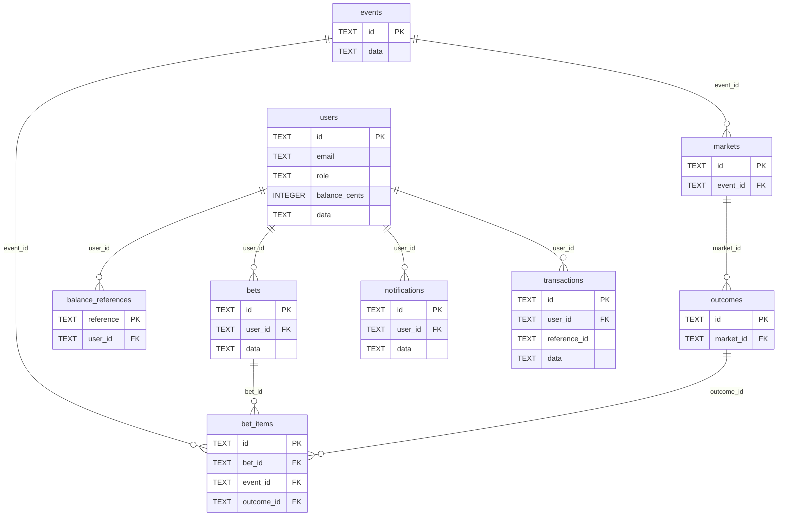
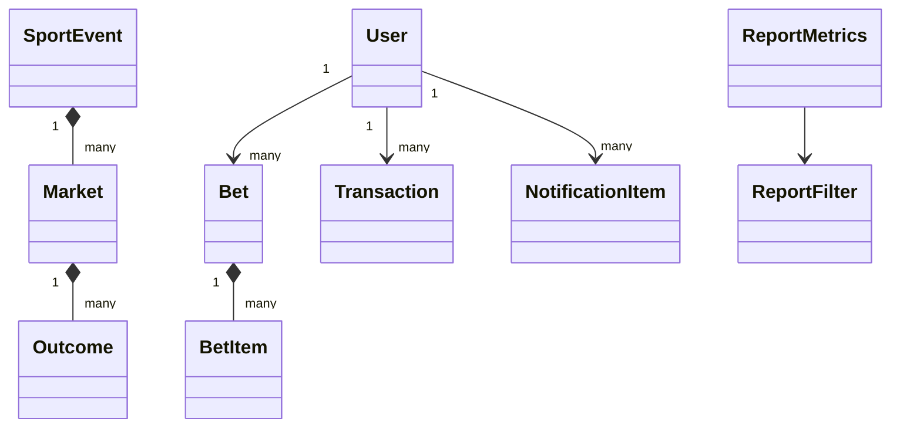
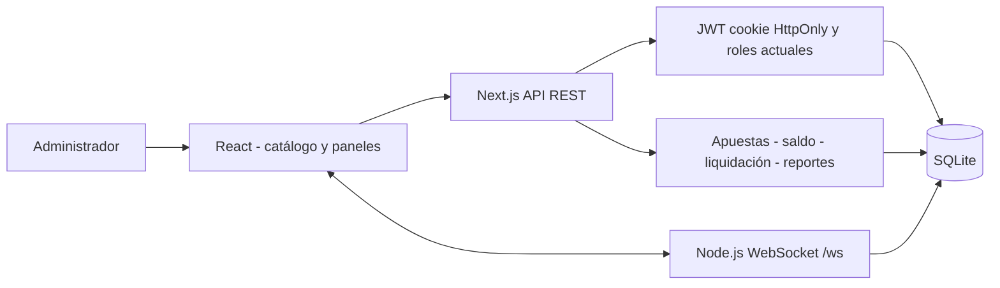
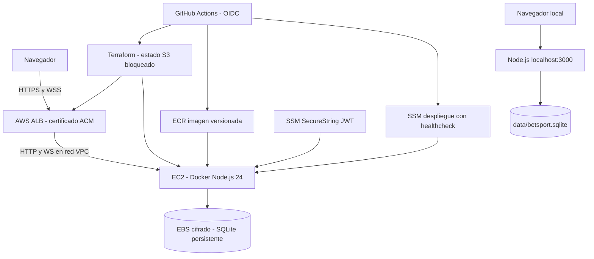

# Documentación del sistema BetSport Pro

Documento generado desde database/schema.sql y lib/types.ts. No depende de datos precargados.

## Arquitectura y persistencia

Next.js y React sirven la interfaz y la API REST. El servidor Node.js 24 agrega WebSockets en /ws. SQLite guarda usuarios, eventos, relaciones, apuestas, movimientos y notificaciones. Las tablas son STRICT y activan claves foráneas. WAL y BEGIN IMMEDIATE protegen las operaciones de saldo y liquidación. Los montos disponibles se almacenan en centavos enteros; las instantáneas JSON conservan el objeto utilizado por la API. Los índices y restricciones se muestran en el esquema SQL incluido al final.

La base arranca vacía. El primer registro, elegido dentro de una transacción, es administrador; los siguientes son apostadores. Cada cuenta empieza con cero. Los movimientos son registros del proyecto personal y no invocan redes de pagos. Los cambios de eventos, cuotas y resultados provienen del administrador. No hay fluctuaciones aleatorias.

## Diccionario físico de datos

### balance_references

| Columna | Tipo | Obligatoria | Clave |
|---|---|---|---|
| reference | TEXT | Sí | PK |
| user_id | TEXT | Sí | FK |

### bet_items

| Columna | Tipo | Obligatoria | Clave |
|---|---|---|---|
| id | TEXT | Sí | PK |
| bet_id | TEXT | Sí | FK |
| event_id | TEXT | Sí | FK |
| outcome_id | TEXT | Sí | FK |

### bets

| Columna | Tipo | Obligatoria | Clave |
|---|---|---|---|
| id | TEXT | Sí | PK |
| user_id | TEXT | Sí | FK |
| data | TEXT | Sí |  |

### events

| Columna | Tipo | Obligatoria | Clave |
|---|---|---|---|
| id | TEXT | Sí | PK |
| data | TEXT | Sí |  |

### markets

| Columna | Tipo | Obligatoria | Clave |
|---|---|---|---|
| id | TEXT | Sí | PK |
| event_id | TEXT | Sí | FK |

### notifications

| Columna | Tipo | Obligatoria | Clave |
|---|---|---|---|
| id | TEXT | Sí | PK |
| user_id | TEXT | No | FK |
| data | TEXT | Sí |  |

### outcomes

| Columna | Tipo | Obligatoria | Clave |
|---|---|---|---|
| id | TEXT | Sí | PK |
| market_id | TEXT | Sí | FK |

### transactions

| Columna | Tipo | Obligatoria | Clave |
|---|---|---|---|
| id | TEXT | Sí | PK |
| user_id | TEXT | Sí | FK |
| reference_id | TEXT | Sí |  |
| data | TEXT | Sí |  |

### users

| Columna | Tipo | Obligatoria | Clave |
|---|---|---|---|
| id | TEXT | Sí | PK |
| email | TEXT | Sí |  |
| role | TEXT | Sí |  |
| balance_cents | INTEGER | Sí |  |
| data | TEXT | Sí |  |

Los campos data contienen JSON validado con json_valid. Sus estructuras se detallan abajo: users usa User; events usa SportEvent con mercados y selecciones; bets usa Bet; transactions usa Transaction; notifications usa NotificationItem. Los IDs de mercados, selecciones e ítems se conservan además en tablas relacionadas para las claves foráneas. Las referencias de depósitos y retiros son únicas globalmente y evitan repetir una operación.

## Diccionario de objetos JSON

### Objeto User

```typescript
id: string;
  name: string;
  email: string;
  password?: string;
  role: UserRole;
  balance: number;
  currency: string;
  createdAt: string;
  updatedAt: string;
```

### Objeto Outcome

```typescript
id: string;
  marketId: string;
  name: string; // ej: "Real Madrid", "Empate", "Manchester City", "Más de 2.5", "Menos de 2.5"
  odds: number; // Decimal: ej 1.85
  previousOdds?: number;
  trend?: "up" | "down" | "same";
  isWinner?: boolean | null;
  status: "OPEN" | "SUSPENDED" | "SETTLED";
```

### Objeto Market

```typescript
id: string;
  eventId: string;
  name: string; // ej: "Ganador del Partido (1X2)", "Total de Goles (Over/Under 2.5)", "Ambos Equipos Anotan"
  type: "1X2" | "TOTALS" | "BTTS" | "HANDICAP" | "MONEYLINE" | "SCORE";
  status: "ACTIVE" | "SUSPENDED" | "CLOSED";
  outcomes: Outcome[];
```

### Objeto SportEvent

```typescript
id: string;
  sport: SportType;
  league: string;
  homeTeam: string;
  awayTeam: string;
  homeScore: number;
  awayScore: number;
  status: EventStatus;
  startTime: string;
  minute: string; // ej: "45'", "82'", "Q3 08:20", "Set 2"
  stadium?: string;
  markets: Market[];
  isFeatured?: boolean;
```

### Objeto BetItem

```typescript
id: string;
  betId: string;
  eventId: string;
  eventName: string;
  marketId: string;
  marketName: string;
  outcomeId: string;
  outcomeName: string;
  odds: number;
  status: "PENDING" | "WON" | "LOST";
```

### Objeto Bet

```typescript
id: string;
  userId: string;
  userName: string;
  type: BetType;
  stake: number;
  totalOdds: number;
  potentialPayout: number;
  status: BetStatus;
  createdAt: string;
  settledAt?: string | null;
  items: BetItem[];
```

### Objeto Transaction

```typescript
id: string;
  userId: string;
  type: TransactionType;
  amount: number;
  balanceBefore: number;
  balanceAfter: number;
  referenceId?: string;
  paymentMethod: string;
  status: TransactionStatus;
  description: string;
  createdAt: string;
```

### Objeto ReportFilter

```typescript
startDate?: string;
  endDate?: string;
  userId?: string;
  sport?: string;
  status?: string;
```

### Objeto ReportMetrics

```typescript
generatedAt: string;
  generatedBy: string;
  filter: ReportFilter;
  totalBets: number;
  totalStake: number;
  totalPayout: number;
  grossGamingRevenue: number; // House margin (TotalStake - TotalPayout)
  winRatePercentage: number;
  pendingBetsCount: number;
  wonBetsCount: number;
  lostBetsCount: number;
  totalDeposits: number;
  totalWithdrawals: number;
  netCashflow: number;
  sportBreakdown: {
    sport: string;
    betsCount: number;
    totalStake: number;
    payout: number;
  }[];
  recentBets: Bet[];
  recentTransactions: Transaction[];
```

### Objeto NotificationItem

```typescript
id: string;
  userId?: string;
  title: string;
  message: string;
  type: "info" | "success" | "warning" | "odds_change";
  timestamp: string;
  read: boolean;
```

## Diagrama entidad relación



## Diagrama de clases



## Diagrama de componentes



## Diagrama de despliegue



## Reglas de negocio

- Depósitos, retiros y apuestas: importe finito entre 1 y 10000 USD, máximo dos decimales. Saldo nunca negativo.
- Apuestas: de 1 a 20 eventos distintos, mercados activos, selección abierta, cuota explícitamente aceptada vigente. Pre-partidos con fecha futura. Retorno máximo de 1000000 USD.
- Liquidación: exactamente un ganador por mercado. La repetición no paga nuevamente. Una combinada ganadora espera todos los resultados; una selección perdedora la resuelve como perdida.
- Cancelación: devuelve el importe completo de los boletos pendientes que contienen el evento, una sola vez.
- Margen del reporte: importe de apuestas ganadas/perdidas menos premios. No incluye pendientes ni canceladas. Las combinadas se agrupan por el deporte del primer evento para no duplicar importes.
- Promociones: mensajes creados por el administrador y difundidos a los usuarios, sin bonos automáticos.

## API y seguridad

POST /api/auth/register, /api/auth/login y /api/auth/logout; GET /api/auth/me. JWT HS256 válido 8 horas, emisor y audiencia verificados. Cookie HttpOnly, SameSite Strict, Secure configurable en HTTPS. No hay secretos por defecto. Inicio de sesión limitado por correo (20 intentos por 15 minutos, por proceso).

GET /api/events, /api/events/{id}; POST /api/bets; GET /api/bets/{userId}; POST /api/balance/deposit y /api/balance/withdraw; GET /api/balance/{userId}; GET /api/notifications. Las rutas de cuenta comprueban identidad y propiedad; las mutaciones siempre usan al usuario autenticado.

POST /api/reports y GET /api/reports; POST, PUT y DELETE /api/admin/events; POST /api/admin/settle; GET y PUT /api/admin/users; GET /api/admin/stats; POST /api/admin/notifications. Requieren rol administrador vigente en base de datos. Las rutas REST solicitadas sin /api se conservan mediante rewrites. GET /api/events/live-feed solo consulta datos persistidos; /ws es el canal de cambios en tiempo real.

## Esquema SQL de origen

```sql
CREATE TABLE IF NOT EXISTS users (
  id TEXT PRIMARY KEY,
  email TEXT NOT NULL UNIQUE COLLATE NOCASE,
  role TEXT NOT NULL CHECK(role IN ('admin','bettor')),
  balance_cents INTEGER NOT NULL DEFAULT 0 CHECK(balance_cents >= 0),
  data TEXT NOT NULL CHECK(json_valid(data))
) STRICT;
CREATE TABLE IF NOT EXISTS events (id TEXT PRIMARY KEY, data TEXT NOT NULL CHECK(json_valid(data))) STRICT;
CREATE TABLE IF NOT EXISTS markets (id TEXT PRIMARY KEY, event_id TEXT NOT NULL REFERENCES events(id)) STRICT;
CREATE TABLE IF NOT EXISTS outcomes (id TEXT PRIMARY KEY, market_id TEXT NOT NULL REFERENCES markets(id)) STRICT;
CREATE TABLE IF NOT EXISTS bets (id TEXT PRIMARY KEY, user_id TEXT NOT NULL REFERENCES users(id), data TEXT NOT NULL CHECK(json_valid(data))) STRICT;
CREATE TABLE IF NOT EXISTS bet_items (id TEXT PRIMARY KEY, bet_id TEXT NOT NULL REFERENCES bets(id), event_id TEXT NOT NULL REFERENCES events(id), outcome_id TEXT NOT NULL REFERENCES outcomes(id)) STRICT;
CREATE TABLE IF NOT EXISTS transactions (id TEXT PRIMARY KEY, user_id TEXT NOT NULL REFERENCES users(id), reference_id TEXT NOT NULL, data TEXT NOT NULL CHECK(json_valid(data))) STRICT;
CREATE TABLE IF NOT EXISTS balance_references (reference TEXT PRIMARY KEY, user_id TEXT NOT NULL REFERENCES users(id)) STRICT;
CREATE TABLE IF NOT EXISTS notifications (id TEXT PRIMARY KEY, user_id TEXT REFERENCES users(id), data TEXT NOT NULL CHECK(json_valid(data))) STRICT;
CREATE INDEX IF NOT EXISTS bets_user ON bets(user_id);
CREATE INDEX IF NOT EXISTS transactions_user ON transactions(user_id);
CREATE INDEX IF NOT EXISTS items_event ON bet_items(event_id);
```
